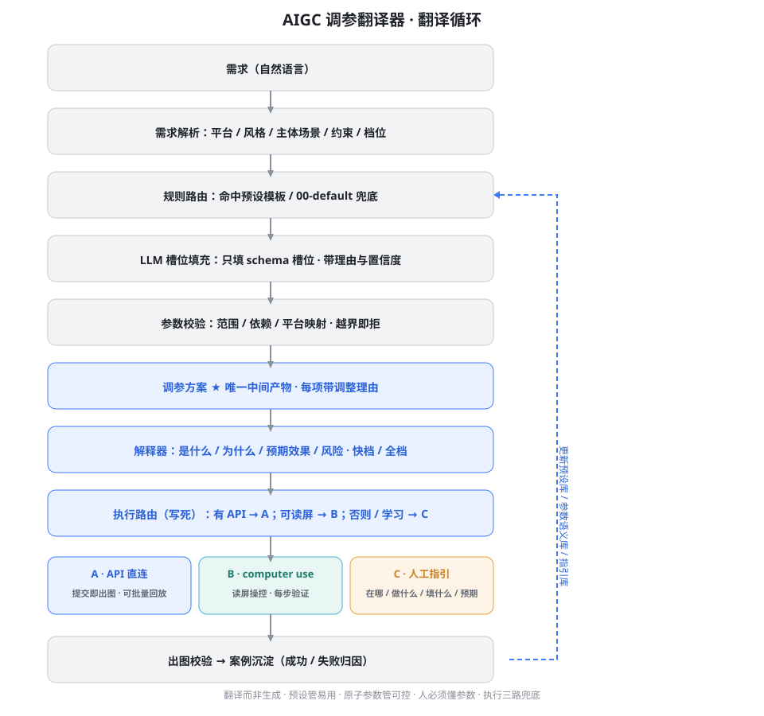
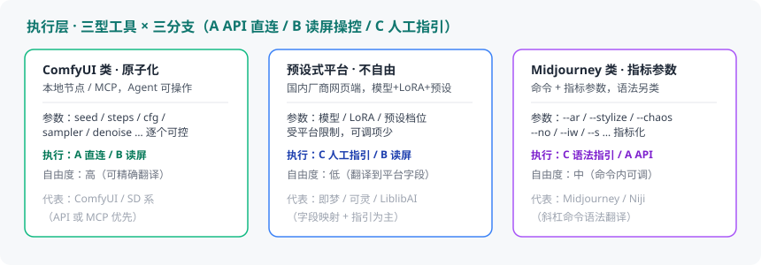

<p align="center">
  
</p>

<h1 align="center">AIGC 调参翻译器 · Param Translator</h1>

<p align="center">
  把「我要这种感觉」翻译成「该这么调参数，以及为什么」。<br>
  <b>预设管易用，原子参数管可控，解释让人真正懂。</b>
</p>

<p align="center">
  
  
</p>

---

## 为什么做这个

工具层已经成熟（ComfyUI+MCP、即梦、可灵、豆包 API……），模型已经商品化，但 AIGC 从业者的产出上下限差距极大：同一底座，有人能出"让人想写小说的世界观图"，有人完全不行。

差距不在工具，在**人层**：方法论 × 资产 × 审美。而最大的断层是——

> **使用者有明确的"感觉"，但不知道它对应哪些参数、怎么调、调了会怎样。**

AIGC 调参翻译器就是补上这一层的 Skill：**需求 → 调参方案 → 参数解释 → 三路执行**。

---

## 核心理念

| 理念 | 含义 |
|---|---|
| **翻译而非生成** | 把需求翻译成参数方案；禁止模型自由发挥，参数可校验、可追溯 |
| **方案即唯一中间产物** | 结构化、可执行、可解释、可复用，每项改动带调整理由 |
| **预设管易用，原子参数管可控** | 命中预设后任一参数可单独覆盖，预设 ≠ 锁死 |
| **人必须懂参数** | 每项改动都能解释：是什么 / 为什么 / 预期效果 / 风险 |
| **执行三路兜底** | API 直连 → 读屏操控 → 人工指引，路由写死，永不卡死 |
| **两腿互为养料** | 读屏操作日志沉淀为指引库，反哺人工指引质量 |
| **资产即文件夹** | 灵感与积累沉淀为文件夹单元（asset.md + media + variants + notes），可搬运、可被方案消费、可在工作台/展示站呈现 |

---

## 快速开始

### 安装

```bash
git clone https://github.com/TEXXXXTURE/aigc-param-translator.git
# 将 aigc-param-translator 放入你的 Agent / Skill 加载目录
```

### 使用

AIGC 任务开始时，Skill 自动执行翻译循环：

1. **需求解析**：目标平台 / 风格 / 主体场景 / 硬约束 / 档位
2. **规则路由**：查 `routes/ROUTE.md` 命中预设（未命中走 00-default）
3. **槽位填充 + 校验**：按原子参数 Schema 填槽，越界即拒
4. **产出调参方案**：结构化中间产物，每项带调整理由
5. **解释**：四件套（是什么 / 为什么 / 预期效果 / 风险）
6. **执行路由**：有 API → 直连；可读屏 → 读屏操控；否则 → 人工指引
7. **交付**：快档（照抄参数表 + 最短指引）或 全档（完整说明书）
8. **校验沉淀**：出图结果回流，更新预设库与语义库

> 例："电商主图，白底，产品是保温杯，突出材质质感" → 命中 `01-ecommerce-hero`，产出带理由的方案与解释。
> "我要那种电影级赛博朋克海报，霓虹青紫调" → 命中 `02-cyberpunk-poster`。

### 定制：新增一个预设

```text
给 Agent 的指令：
"这是我经常做的 X 类型需求（附 2–3 个典型例子和常用参数）。请按 routes/presets/ 的格式
新建一张预设卡，我确认后写入。"
```

---

## CLI 工具：ptr（资产库确定性操作）

Skill 负责推理（翻译循环 / 路由 / 解释 / 护栏），**确定性操作交给内置 CLI `ptr`**（TypeScript，零运行时依赖，Node ≥ 18）：

```bash
# 构建（tools/bin/ 下）
cd tools/bin && npm install && npm run build

# 使用（Windows: tools/bin/ptr.cmd；Linux/macOS: tools/bin/ptr）
ptr init --root <资产库根>                        # 初始化骨架：00-index.md / library.json / _pending/
ptr asset add <本地文件|URL|文本> --kind <k> [--name n] [--slug s] [--media m] [--tags a,b]   # 采集 → _pending 草稿
ptr asset ls --root <根>                          # 列出资产（含 _pending）
ptr asset approve <id> --root <根>                # 过门禁（校验通过才移入正式目录）
ptr validate [资产目录|asset.md] --root <根>       # 门禁校验（有问题退出码 1）
ptr index --root <根>                             # 生成 00-index.md + library.json
ptr search <关键词> [--kind k] [--tag t]          # 检索资产
ptr sitegen --root <根> [--out 目录]               # 一键生成静态展示站（默认 <根>/_site）
```

- 根目录解析：`--root` 参数 > 环境变量 `AIGC_LIBRARY_ROOT` > `./assets-library`
- 品类枚举：character / persona / chardesign / costume / scene / worldview / style / shot / concept / story / material / object / environment / prompt / case / custom
- **中文名注意**：资产 id 只允许 ASCII（`<kind>.<name>`，name 为 a-z0-9_），中文显示名用 `--name` 指定、`--slug` 给英文 id；Windows 控制台向 node 传中文路径/名称有编码风险，建议路径用 ASCII、中文内容在 asset.md 内编辑
- 源码与协议说明见 `tools/bin/`（`ptr --help` 看全部用法）

---

## 文件结构

```text
aigc-param-translator/
├── SKILL.md                 协议主文件：翻译循环 + 路由 + 解释 + 执行路由
├── PRD.md                   产品需求文档（架构决策全记录）
├── routes/
│   ├── ROUTE.md             预设路由表（Agent 查表处）
│   └── presets/             预设模板库（00 默认 + 01–06 场景）
├── schema/
│   ├── params.schema.json   原子参数 Schema（含语义字段）
│   └── plan.schema.json     调参方案中间产物 Schema
├── knowledge/
│   ├── params.md           ★ 参数语义库（解释器底座）
│   ├── exec-branches.md     执行层三分支路由与指引规范
│   └── assets.md            插件接口契约（抠图/拆层/LoRA/搜索，背后接现成实现）
├── library/
│   ├── LIBRARY.md          ★ 资产库主协议（folder-as-asset + 采集入库 + 消费与展示）
│   ├── asset.schema.json    资产主档 Schema（介质轴 × 品类轴）
│   ├── sitegen.md           一键展示站生成器契约（对接工作台看板）
│   └── example/             示例资产（仅验证 schema，非真实素材）
├── tools/
│   ├── translator.md        翻译器工作流（路由 → 槽位 → 校验）
│   ├── explainer.md         解释器工作流（四件套 + 两档）
│   ├── planner.md           快档 / 全档输出规范
│   ├── verifier.md          出图校验 + 案例沉淀（进化回路）
│   └── bin/                ★ ptr CLI（TypeScript：资产入库/校验/索引/检索/展示站）
├── shared/
│   ├── safeguards.md        通用保真护栏
│   └── glossary.md          术语对照（原子参数 ↔ 平台字段）
└── assets/                  banner.svg / architecture.svg / execution-tools.svg
```

---

## 架构

<p align="center">
  
</p>

### 翻译循环

```text
自然语言需求
  ↓
需求解析（平台 / 风格 / 主体 / 约束 / 档位）
  ↓
规则路由 ──命中──▶ 读取预设模板（档位基底）
  │
  未命中 → 00-default 兜底
  ↓
LLM 槽位填充（只填 schema 槽位，带理由与置信度）
  ↓
参数校验（范围 / 依赖 / 平台映射；越界即拒）
  ↓
调参方案（唯一中间产物）
  ↓
解释器（是什么 / 为什么 / 预期效果 / 风险）
  ↓
执行路由（写死）：
  有 API ──▶ A 直连
  可读屏 ──▶ B computer use（每步验证，失败回退 C）
  否则/学习 ─▶ C 人工指引（方案 × 界面映射 × 语义库）
  ↓
交付（快档 / 全档）→ 出图校验 → 案例沉淀 → 更新预设库 / 语义库
```

### 执行层 · 三型工具（A / B / C 分支对应）

<p align="center">
  
</p>

| 工具类型 | 特征 | 参数方式 | 执行分支 | 自由度 |
|---|---|---|---|---|
| **ComfyUI 类**（原子化） | 本地节点 / MCP，Agent 可操作 | seed / steps / cfg / sampler… 逐个可控 | A 直连 · B 读屏 | 高 |
| **预设式平台**（国内厂商） | 网页端预设 + 模型 + LoRA | 平台字段受限于预设档位 | C 人工指引 · B 读屏 | 低 |
| **Midjourney 类**（指标参数） | 斜杠命令 + 指标参数 | `--ar` `--stylize` `--chaos` `--no` `--iw`… | C 语法指引 · A API | 中 |

> 三分支共用同一份调参方案：方案只管"翻译成什么"，A/B/C 只解决"怎么执行"。

---

## 路线图

- [x] M0：PRD 与架构定稿
- [x] M1：原子参数 Schema + 参数语义库（首批 ~24 参数）
- [x] M2：预设库（默认 + 6 个场景）
- [x] M3：翻译器 / 解释器 / 规划器工作流
- [ ] M4：执行层三分支实跑（先 C 后 B/A）
- [ ] M5：进化回路真实案例沉淀
- [~] M6：资产库模块（library）—— 协议 + ptr CLI 已落盘（入库/门禁/索引/检索/展示站跑通演示）；待真实资产入库验证
- [ ] 扩展：更多平台映射（即梦 / 可灵 / 豆包 API 字段）
- [ ] 英文版 README

---

## License

[MIT](./LICENSE) © 2026 TEXXXXTURE

*把感觉翻译成参数，把参数解释成人话。*
